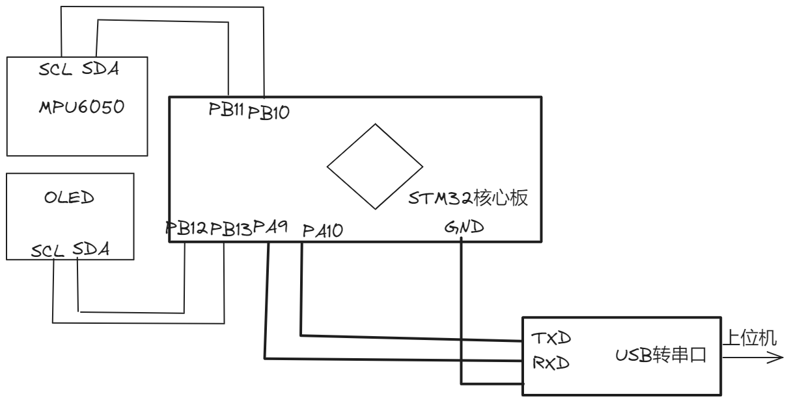
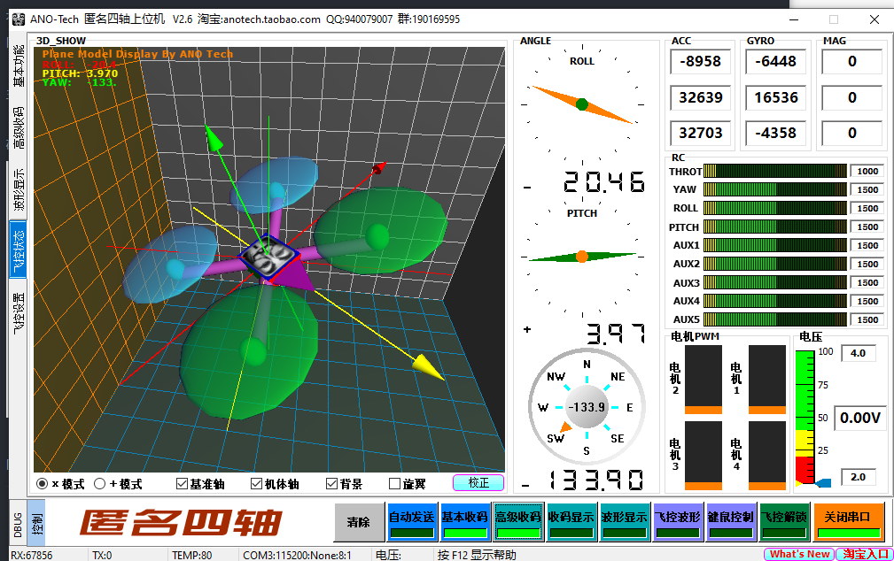

# 中文简介

本程序使用MPU6050六轴加速度计陀螺仪实现测量芯片的加速度和角速度

同时通过移植DMP库测量芯片各个方位的各个方位欧拉角(pitch, roll, yaw),

## 主控: STM32F103C8T6核心板     使用MPU6050陀螺仪加速度计(附带DMP库移植)

硬件接线图如下: 

其中, 需要说明的是, 一般STLink的供电可能不稳定导致数据停滞的情况, 建议使用USB数据线接入TypeB接口进行供电;

显示效果如下图所示, 会在OLED 屏幕上显示pitch(俯仰角), roll(翻滚角)和yaw(偏航角)

同时, 本程序可以使用匿名四轴上位机软件进行观察效果, 需要注意的是, 串口通信波特率设置为115200; 

